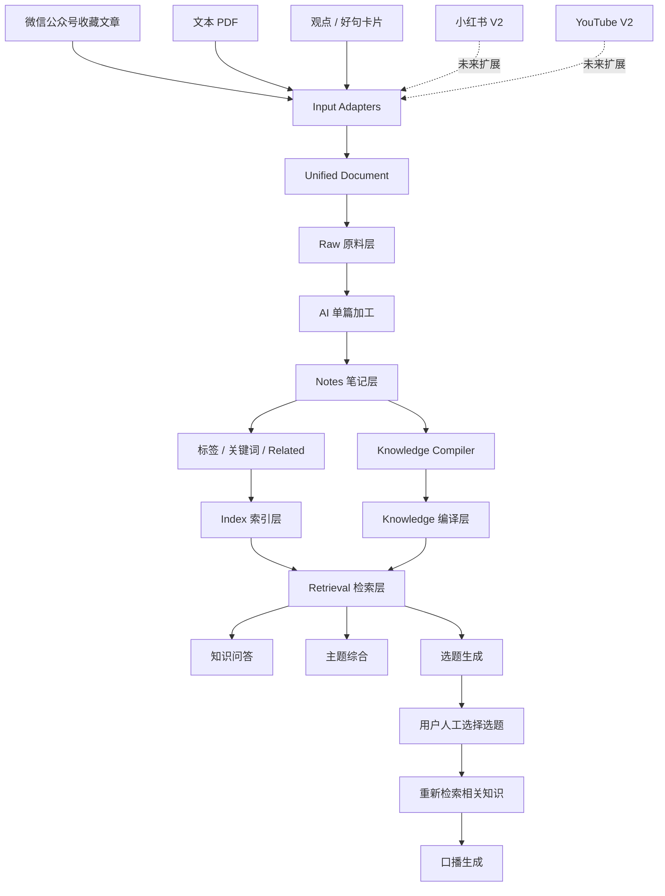
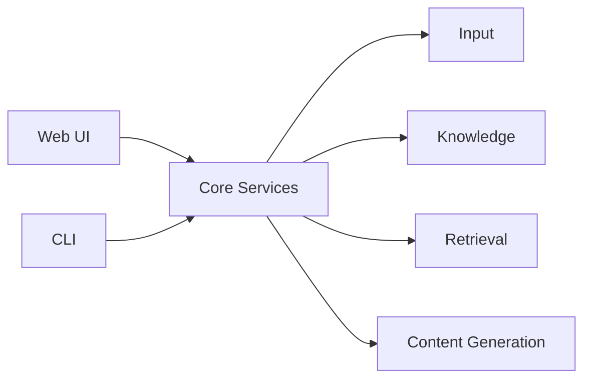
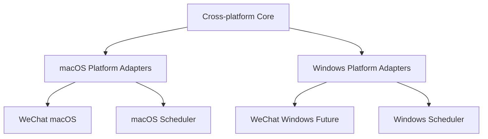

# Personal AI Knowledge Base — ARCHITECTURE.md

> Version: v0.1  
> Status: Approved draft for Codex handoff  
> Based on: PRODUCT.md v0.1

## 1. 架构目标

V1 采用“编译型个人知识库”思路：

输入  
→ 原始资料  
→ 单篇理解  
→ 多篇知识编译  
→ 索引 / 检索  
→ 问答 / 选题  
→ 口播

核心原则：

- Raw 原始数据不可被 AI 修改
- 文件优先、本地优先
- V1 不依赖向量数据库
- AI 负责语义工作，脚本负责机械工作
- 输入源通过 Adapter 隔离
- AI 模型通过 Provider 隔离
- macOS 为主运行环境，Windows 保留兼容
- 微信是外围输入 Adapter，失败不能拖垮知识库核心

---

## 2. 总体数据流



---

## 3. 输入层：Input Adapters

所有输入先转换为统一 `UnifiedDocument`，核心系统不直接依赖具体来源。

### 3.1 WeChat Adapter

职责：

- 读取微信收藏新增项
- 只允许微信公众号文章进入系统
- 过滤视频、视频号、普通 URL、图片、音频、小程序、文件、聊天记录等
- 提取标题、正文、作者、来源 URL、时间等
- 去重
- 转为 UnifiedDocument

微信数据结构变化时，只替换 Adapter，不改核心知识链路。

### 3.2 PDF Adapter

职责：

- 处理有正常文本层的 PDF
- 提取正文与基础 metadata
- 转为 UnifiedDocument

不处理 OCR / 扫描 PDF。

### 3.3 Idea Card Adapter

职责：

- 保存观点、好句、灵感、自我判断
- 转为 UnifiedDocument
- 允许更轻量的处理流程

### 3.4 V2 Adapters

预留：

- Xiaohongshu Adapter
- YouTube Adapter
- 其他来源

---

## 4. UnifiedDocument

概念数据结构：

```yaml
id:
content_type: article | pdf | idea
title:
content:
source_type: wechat | pdf | manual
source_url:
author:
published_at:
ingested_at:
original_file:
tags:
metadata:
```

不是所有字段都强制存在。

---

## 5. 存储分层

### 5.1 Raw — 原料层

保存原始事实来源：

- 微信文章原文
- PDF 原文件 / 提取文本
- 用户原始观点

规则：

**Raw Immutable。**

AI 不得覆盖 Raw。

### 5.2 Notes — 单篇知识层

每份资料经 AI 理解后生成一份 Note，至少包含：

- 摘要
- 核心观点
- 值得保留的表达
- 标签
- 来源
- Related
- 用户备注（如有）

Notes 回答：

> 这一篇资料讲了什么？

### 5.3 Knowledge — 编译层

将多个相关 Notes 编译为主题级“当前认知”，例如：

`knowledge/AI视频生成.md`

Knowledge 回答：

> 关于这个主题，我目前一共知道什么？

内容可包含：

- 主要路线
- 共识
- 分歧
- 原理
- 优缺点
- 案例
- 当前综合判断
- 对应 Notes / Raw

### 5.4 Index — 索引层

记录：

- 文档 ID
- 标题
- 日期
- 内容类型
- 标签
- 关键词
- Topic
- Related
- 来源路径

Index 用于快速知道“库里有什么”，避免每次读取全部文件。

---

## 6. Related 关联机制

V1 不把向量相似度作为核心。

优先使用：

- AI 标签
- 标题关键词
- 关键词重叠
- Topic
- 简单规则打分
- 必要时 AI 对候选进行语义判断

满足阈值时写入双向 Related：

A → B  
B → A

关联应可解释、可检查。

---

## 7. Retrieval 检索层

V1 优先使用：

1. Index
2. 标题
3. 标签
4. 关键词
5. Topic
6. Related
7. AI 对候选内容做语义判断

不以以下链路作为 V1 主架构：

Chunk → Embedding → Vector DB → Top-K

但保留 Retrieval 抽象层，未来真实使用证明召回不足时，可以升级为 Hybrid / Vector Search，而不推翻 Raw → Notes → Knowledge。

---

## 8. 问答流

示例问题：

“AI 生成视频有哪些思路？”

优先流程：

问题  
→ 查 Index  
→ 找 Knowledge Topic  
→ 读取主题 Knowledge  
→ 必要时沿 Notes / Related 补充  
→ 必要时回 Raw 核验  
→ 生成回答

---

## 9. 选题生成流

输入：

- 全库 Index
- Knowledge Topics
- 近期 Notes
- 观点卡片

处理：

- 近期资料适当加权
- 识别新信息、趋势、冲突、案例、普通用户痛点
- 生成 3～5 个 AI 提效方向候选选题

选题不是简单改写最近几篇标题。

---

## 10. 口播生成流

候选选题  
→ 用户人工选择  
→ Retrieval 重新找证据  
→ Knowledge + Notes + Idea Cards + 必要 Raw  
→ 构建写作上下文  
→ 生成 2～3 分钟口播稿

原则：

**先找证据，再写稿。**

---

## 11. AI Provider

核心业务不绑定单一模型。

统一抽象：

- summarize()
- extract_key_points()
- extract_quotes()
- generate_tags()
- link_related()
- compile_topic()
- answer_question()
- generate_topics()
- write_script()

底层可以替换为不同 API / 模型实现。

---

## 12. Web UI 与 CLI



Web UI 和 CLI 共用 Core，不各写一套业务逻辑。

---

## 13. 平台架构



平台原则：

- macOS：主开发 / 主运行
- Windows：备用运行环境
- 不维护长期 `mac` / `windows` 分支
- 平台差异放 Adapter
- Core 尽量跨平台

---

## 14. 微信的架构位置

微信同步是高风险外围能力：

WeChat Adapter Failure ≠ Knowledge Base Failure

即使微信同步暂时失败：

- PDF 导入正常
- 观点卡片正常
- Notes / Knowledge 正常
- Retrieval 正常
- 选题正常
- 口播正常

---

## 15. V1 核心原则

1. Raw 永远是事实来源
2. Raw 不可被 AI 修改
3. Notes 是单篇理解
4. Knowledge 是多篇编译
5. 编译优先于每次重新翻原文
6. V1 不依赖向量数据库
7. Input Adapter 解耦来源
8. AI Provider 解耦模型
9. Web UI / CLI 共用 Core
10. 微信失败不拖垮核心
11. 核心保持 macOS / Windows 兼容可能
12. AI 结论尽量可追溯回 Raw
