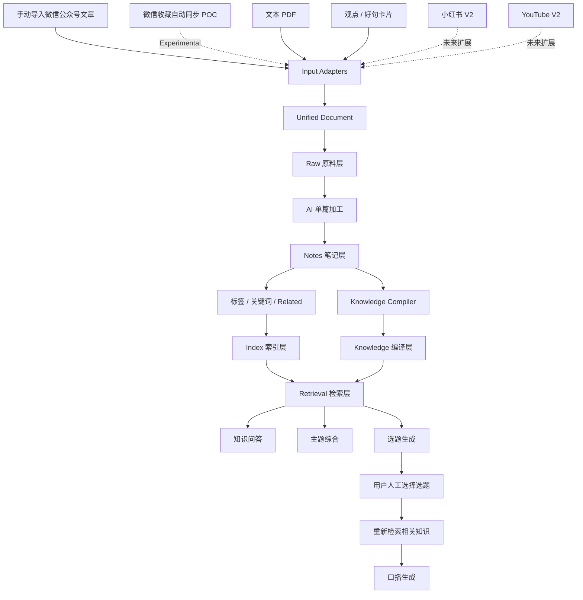
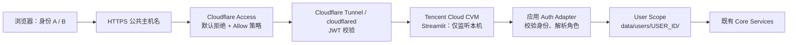
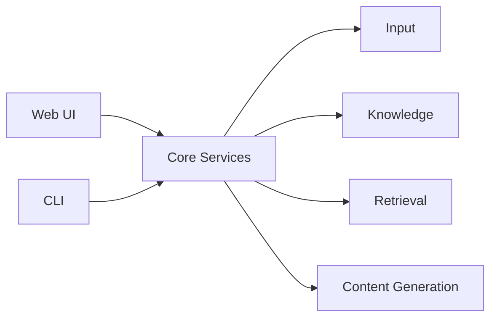
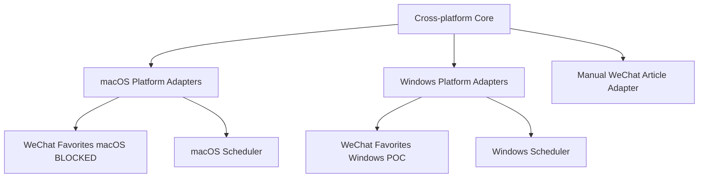
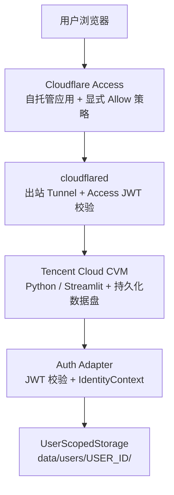

# Personal AI Knowledge Base — ARCHITECTURE.md

> Version: v0.2
> Status: V1 baseline approved；V2 multi-user design proposal（未实现）
> Based on: PRODUCT.md v0.2

## 1. 架构目标

V1 采用“编译型个人知识库”思路：

输入  
→ 原始资料  
→ 单篇理解  
→ 多篇知识编译  
→ 索引 / 检索  
→ 问答 / 选题  
→ 口播

核心原则：

- Raw 原始数据不可被 AI 修改
- 文件优先、本地优先
- V1 不依赖向量数据库
- AI 负责语义工作，脚本负责机械工作
- 输入源通过 Adapter 隔离
- AI 模型通过 Provider 隔离
- macOS 为主运行环境，Windows 保留兼容
- 微信是外围输入 Adapter，失败不能拖垮知识库核心
- V1 保留现有本地单用户根目录；V2 只在认证成功后选择用户级根目录
- Cloudflare Access 负责入口访问控制，不替代应用层的身份解析、角色判断和数据隔离

---

## 2. 总体数据流



### 2.1 V1 与 V2 请求边界

V1 的本地模式仍直接启动 Streamlit，使用现有 `data/` 根目录，不经过登录。V2 的 Web 请求必须经过以下链路；V2 未完成前，这只是目标架构：



Access 拒绝未认证请求，Tunnel 将通过策略的请求转发到腾讯云本机服务；应用仍必须建立明确的身份上下文，并在没有合法上下文时失败关闭。任何绕过 Cloudflare 直接访问 CVM 的路径都不属于有效部署。

---

## 3. 输入层：Input Adapters

所有输入先转换为统一 `UnifiedDocument`，核心系统不直接依赖具体来源。

### 3.1 WeChat Input

微信输入拆为两个独立 Adapter，两者都输出既有 `UnifiedDocument`。

#### Manual WeChat Article Adapter（V1）

职责：

- 接受明确的微信公众号文章 URL
- 自动提取失败时接受标题、正文和原始 URL
- 拒绝普通网页 URL、视频号和其他不受支持的微信链接
- 去重并转为 UnifiedDocument

#### Favorites Auto Sync Adapter（Experimental / POC）

职责：

- 读取微信收藏新增项
- 只允许微信公众号文章进入系统
- 过滤视频、视频号、普通 URL、图片、音频、小程序、文件、聊天记录等
- 提取标题、正文、作者、来源 URL、时间等
- 去重
- 转为 UnifiedDocument

macOS 与 Windows 只是 Favorites Auto Sync Adapter 的平台实现。微信数据结构变化或平台 POC 失败时，只替换相应 Adapter，不改核心知识链路。

### 3.2 PDF Adapter

职责：

- 处理有正常文本层的 PDF
- 提取正文与基础 metadata
- 转为 UnifiedDocument

不处理 OCR / 扫描 PDF。

### 3.3 Idea Card Adapter

职责：

- 保存观点、好句、灵感、自我判断
- 转为 UnifiedDocument
- 允许更轻量的处理流程

### 3.4 V2 Adapters

预留：

- Xiaohongshu Adapter
- YouTube Adapter
- 其他来源

---

## 4. UnifiedDocument

概念数据结构：

```yaml
id:
content_type: article | pdf | idea
title:
content:
source_type: wechat | pdf | manual
source_url:
author:
published_at:
ingested_at:
original_file:
tags:
metadata:
```

不是所有字段都强制存在。

---

## 5. 存储分层

### 5.1 Raw — 原料层

保存原始事实来源：

- 微信文章原文
- PDF 原文件 / 提取文本
- 用户原始观点

规则：

**Raw Immutable。**

AI 不得覆盖 Raw。

### 5.2 Notes — 单篇知识层

每份资料经 AI 理解后生成一份 Note，至少包含：

- 摘要
- 核心观点
- 值得保留的表达
- 标签
- 来源
- Related
- 用户备注（如有）

Notes 回答：

> 这一篇资料讲了什么？

### 5.3 Knowledge — 编译层

将多个相关 Notes 编译为主题级“当前认知”，例如：

`knowledge/AI视频生成.md`

Knowledge 回答：

> 关于这个主题，我目前一共知道什么？

内容可包含：

- 主要路线
- 共识
- 分歧
- 原理
- 优缺点
- 案例
- 当前综合判断
- 对应 Notes / Raw

### 5.4 Index — 索引层

记录：

- 文档 ID
- 标题
- 日期
- 内容类型
- 标签
- 关键词
- Topic
- Related
- 来源路径

Index 用于快速知道“库里有什么”，避免每次读取全部文件。

### 5.5 V1 / V2 存储根目录

V1 继续使用当前单用户目录：

```text
data/
├── raw/
├── notes/
├── knowledge/
└── index/
```

V2 不把所有用户继续写入上述共享目录，而是为每个已认证身份建立独立根目录：

```text
data/users/<user_id>/
├── raw/
├── notes/
├── knowledge/
├── index/
└── history/
```

上传文件、导出文件和包含用户内容的缓存也必须位于当前用户根目录或仅存在于当前进程内；不得因为“不是核心知识文件”而写入全局共享目录。`history/` 保存问答、选题、口播及结果状态，具体记录格式由 TASK-030 定义，但隔离边界在本任务确定。

`<user_id>` 不是邮箱，也不是请求参数。推荐使用 `u_` 加上 `sha256(iss + "\0" + sub)` 的小写十六进制结果生成稳定、路径安全的内部标识；页面可以展示邮箱，但不能用邮箱变化触发目录迁移。V1 的 `data/` 与 V2 的 `data/users/` 必须保持物理路径和访问模式可区分。

### 5.6 用户隔离不变量

以下规则适用于 V2 的每个读写入口：

1. 当前用户根目录由服务器端身份上下文计算，不能由表单、查询参数、上传文件名或客户端状态指定。
2. Raw、Notes、Knowledge、Index、历史、下载和检索候选都先绑定当前根目录，再执行具体业务操作。
3. 不存在合法身份时，不得回退到 V1 共享根目录；无身份、未知身份、未知角色和路径穿越一律拒绝。
4. `admin` 只拥有运行维护和自己的知识库权限，不自动拥有 `member` 内容或历史的读取权限。
5. 缓存键、临时文件和 Streamlit 会话中的持久化引用不得跨用户复用；日志默认只记身份摘要、操作类型和结果状态，不记录 Raw 正文、密钥或完整认证头。

---

## 6. Related 关联机制

V1 仍以可解释的文件和 JSON Index 信号为基础，不依赖向量数据库；当前可在此基础上按配置启用 embedding 语义召回，但不改变 Raw → Notes → Knowledge 主链路。

优先使用：

- AI 标签
- 标题关键词
- 关键词重叠
- Topic
- 简单规则打分
- 必要时 AI 对候选进行语义判断

满足阈值时写入双向 Related：

A → B  
B → A

关联应可解释、可检查。

---

## 7. Retrieval 检索层

V1 优先使用：

1. Index
2. 标题
3. 标签
4. 关键词
5. Topic
6. Related
7. AI 对候选内容做语义判断

可选的 embedding 相似度只能作为候选排序的辅助信号；它不能扩大当前用户的候选边界，也不能替代来源追踪。

不以以下链路作为 V1 主架构：

Chunk → Embedding → Vector DB → Top-K

但保留 Retrieval 抽象层，未来真实使用证明召回不足时，可以升级为 Hybrid / Vector Search，而不推翻 Raw → Notes → Knowledge。

V2 不改变检索算法的 V1 选择，但在检索入口之前增加 User Scope：先读取当前用户的 Index 和 Knowledge，再执行直接匹配或语义召回。全局索引不是 V2 首期方案；任何排序、来源或语义候选都不得混入其他用户数据。

---

## 8. 问答流

示例问题：

“AI 生成视频有哪些思路？”

优先流程：

问题  
→ 查 Index  
→ 找 Knowledge Topic  
→ 读取主题 Knowledge  
→ 必要时沿 Notes / Related 补充  
→ 必要时回 Raw 核验  
→ 生成回答

V2 中的 `Index`、`Knowledge`、`Notes` 和 `Raw` 都先限定为当前用户根目录；“查库”不表示读取全体用户。

---

## 9. 选题生成流

输入：

- V1：全库 Index、Knowledge Topics、近期 Notes 和观点卡片
- V2：当前用户根目录内的 Index、Knowledge Topics、近期 Notes 和观点卡片

处理：

- 近期资料适当加权
- 识别新信息、趋势、冲突、案例、普通用户痛点
- 生成 3～5 个 AI 提效方向候选选题

选题不是简单改写最近几篇标题。

---

## 10. 口播生成流

候选选题  
→ 用户人工选择  
→ Retrieval 重新找证据  
→ Knowledge + Notes + Idea Cards + 必要 Raw  
→ 构建写作上下文  
→ 生成 2～3 分钟口播稿

原则：

**先找证据，再写稿。**

---

## 11. AI Provider

核心业务不绑定单一模型。

统一抽象：

- summarize()
- extract_key_points()
- extract_quotes()
- generate_tags()
- link_related()
- compile_topic()
- answer_question()
- generate_topics()
- write_script()

底层可以替换为不同 API / 模型实现。

---

## 12. Web UI 与 CLI



Web UI 和 CLI 共用 Core，不各写一套业务逻辑。

V1 CLI 继续以本地单用户模式运行。V2 首期只验收经过 Cloudflare Access 的 Web UI；CLI 不自动继承云端登录身份，也不得在没有显式用户上下文时写入多用户根目录。若未来需要远程 CLI，必须另设认证方式和任务，不把本地 CLI 当作 V2 已完成入口。

---

## 13. 平台架构



平台原则：

- macOS：主开发 / 主运行
- Windows：备用运行环境
- 不维护长期 `mac` / `windows` 分支
- 平台差异放 Adapter
- Core 尽量跨平台

### 13.1 V2 运行链路



Cloudflare 边缘的 HTTPS 与登录页不是应用层授权的替代品。TASK-032 配置 Tunnel 时应启用 `originRequest.access.required=true` 并填写目标 Access application 的 `audTag`；CVM 上的 Streamlit 应绑定本机地址，安全组和主机防火墙不得把应用端口作为公开访问入口。Tunnel 服务由受控的系统服务管理，数据盘必须在部署验收中证明重启后仍可读取。

### 13.2 身份、角色与可信边界

应用层使用 Cloudflare Access 应用 JWT 的 `Cf-Access-Jwt-Assertion` 请求头作为身份输入。Streamlit 入口应通过公开的只读 `st.context.headers` 读取初始请求头，不使用已废弃的私有 WebSocket header API。

无域名轻量分享可以改用 `PKB_AUTH_MODE=local`：应用内用户名密码登录由 `LocalAuthenticator` 校验，密码只保存 PBKDF2 哈希，成功后的 `IdentityContext` 与 Cloudflare 模式进入同一个 `UserScopedStorage`。该模式用于低风险朋友间分享，不提供 Access 边缘防护，不应视为生产部署。

实现时必须校验：

- JWT 签名和允许的算法；公钥来自当前 Cloudflare Access team 的官方证书端点，不从请求中接受公钥。
- `iss` 与预配置的 Access team issuer 一致。
- `aud` 包含本应用的 Access audience tag。
- `exp`、`nbf`（如存在）和必要的时间窗口有效。
- `sub` 非空，并能映射到唯一的内部 `user_id`。

`email` 只用于显示和必要的审计，不作为授权或路径输入。首期角色映射由服务器侧受保护配置维护 `sub → admin | member`，身份必须恰好命中一个角色；未知或冲突角色返回拒绝。认证头、Access cookie 和服务密钥不得写入用户数据、页面正文、日志或 Git。

这里的身份校验与 Tunnel 的 Access JWT 校验是两道边界：Tunnel 负责阻断未通过 Access 的请求，应用负责生成明确的 `IdentityContext` 并把它绑定到存储与权限。即使某次部署误把源站暴露出来，应用也不能仅凭一个未经校验的邮箱头放行。

### 13.3 失败路径

| 失败条件 | 处理 | 禁止的回退 |
| --- | --- | --- |
| Access 无 Allow、未登录或 Tunnel 不可用 | 由入口拒绝或返回不可用错误，不进入业务层 | 直接暴露 CVM 端口、绕过登录、切到共享目录 |
| JWT 缺失、签名／`iss`／`aud`／时间校验失败 | 应用返回 401／403，停止本次请求 | 相信 `email`、Cookie 或客户端传入的 `user_id` |
| `sub` 缺失、角色未知或同时命中两个角色 | 返回 401／403，记录无敏感信息的失败状态 | 默认赋予 `member`、`admin` 或 V1 单用户 |
| 目录路径非法、越权路径或存储读写失败 | 返回可读错误；写入操作保持 Raw 不覆盖且不产生半成品 | 使用 `../`、绝对路径或其他用户根目录重试 |
| 进程重启、磁盘挂载失败或数据损坏 | 停止写入，交由部署／备份流程恢复 | 静默创建空目录并假装历史不存在 |

拒绝和错误信息可以帮助用户判断“需要重新登录”“没有权限”或“服务暂不可用”，但不得显示认证头、密钥、绝对服务器路径或其他用户的文件名。

---

## 14. 微信的架构位置

Manual WeChat Article Adapter 是 V1 稳定输入。Favorites Auto Sync 是高风险外围能力：

Favorites Auto Sync Failure ≠ Knowledge Base Failure

即使微信同步暂时失败：

- PDF 导入正常
- 观点卡片正常
- Notes / Knowledge 正常
- Retrieval 正常
- 选题正常
- 口播正常

---

## 15. V1 核心原则

1. Raw 永远是事实来源
2. Raw 不可被 AI 修改
3. Notes 是单篇理解
4. Knowledge 是多篇编译
5. 编译优先于每次重新翻原文
6. V1 不依赖向量数据库
7. Input Adapter 解耦来源
8. AI Provider 解耦模型
9. Web UI / CLI 共用 Core
10. 微信失败不拖垮核心
11. 核心保持 macOS / Windows 兼容可能
12. AI 结论尽量可追溯回 Raw

## 16. V2 首期范围、迁移与回滚

V2 首期的最小垂直切片是：两个测试身份通过同一 Access 入口到达同一个 Streamlit 应用；应用显示当前身份和角色；A／B 各自完成一条导入、检索、问答、口播、历史和下载路径；任何一方都不能看到另一方内容；无身份和非法身份失败关闭；V1 本地回归继续通过。

V1 到 V2 的数据迁移不是启动副作用。迁移任务必须先停止写入、备份现有 `data/`、生成源到目标清单、明确唯一用户归属，再复制到 `data/users/<user_id>/` 并逐项校验；失败时保留源数据和已生成目标，不删除或覆盖原始文件。当前任务不实施迁移，也不改变已有 V1 数据。

回滚以保留数据为前提：停止 V2 Web 服务和 Tunnel，保留 `data/users/` 及日志证据，恢复到 V1 本地运行方式并继续使用原 `data/` 根目录。云端认证失败不能自动把请求导向共享单用户目录；任何临时恢复都必须由运维人员明确选择运行模式并重新验证。
