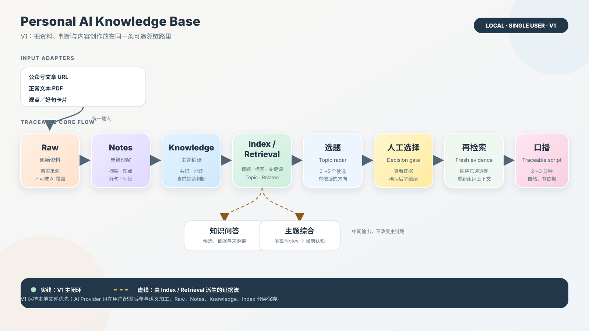

# Personal AI Knowledge Base

把看过的 AI 资料，变成下一次可以直接调用的知识和内容素材。

> 当前版本：V1 本地、单用户 Streamlit MVP。
>
> 后续路线：V2 Cloudflare Access ＋ 腾讯云 ＋ 多用户隔离（规划中，尚未部署）。

## 它解决什么问题

AI 学习资料通常散落在公众号文章、课程 PDF 和临时笔记里。收藏并不等于掌握：过一段时间之后，很难回忆自己看过什么、不同资料之间有什么关系，也很难把它们重新变成一条有证据的内容。

这个项目把“阅读 -- 理解 -- 综合 -- 创作”放在同一条可追溯链路中：原始资料保留在本地，AI 生成的单篇笔记和主题知识与原文分层保存，检索结果带来源，口播生成前还需要人工确认选题。

对使用者的直接收益是：下一次准备写 AI 提效内容时，不必从零开始搜索，而是从自己的资料、判断和已形成的主题认知出发。

它不是单纯的收藏夹，也不是把所有内容丢进黑盒 RAG 的问答页面；V1 更关注三件事：资料不会被 AI 覆盖、结论能够回到来源、知识最终能够进入内容生产。

## 当前边界，一眼看懂

| 维度 | V1 当前状态 |
| --- | --- |
| 运行方式 | 本地文件系统 ＋ Streamlit；macOS 为主，Windows 作为备用兼容环境 |
| 用户模型 | 单用户；没有登录、权限或团队协作 |
| 稳定输入 | 微信公众号文章 URL、正常文本 PDF、观点／好句卡片 |
| 核心输出 | 本地检索、知识问答、主题综合、3～5 个候选选题、人工确认后的 2～3 分钟口播稿 |
| 检索 | 标题、标签、关键词、Topic、Related 和 JSON Index；Web UI 可选 Embedding 语义召回 |
| 云端状态 | 没有当前生产部署；Cloudflare Access、腾讯云和多用户隔离属于 V2 规划 |

## V1 闭环：从 Raw 到口播

主链路可以压缩成一句话：

```text
Raw → Notes → Knowledge → Index / Retrieval → 选题 → 人工选择 → 再检索 → 口播
```



每一层解决不同问题：

| 阶段 | 做什么 | 为什么保留这一层 |
| --- | --- | --- |
| `Raw` | 保存公众号正文、PDF 原文件／文本或用户原始观点 | 它是事实来源，保持不可被 AI 覆盖 |
| `Notes` | 对单篇资料生成摘要、核心观点、好句、标签和来源 | 回答“这一篇讲了什么” |
| `Knowledge` | 把同一主题的多篇 Notes 编译成当前认知 | 回答“关于这个主题，我目前一共知道什么” |
| `Index / Retrieval` | 用标题、标签、关键词、Topic、Related 和 JSON Index 找候选证据 | 让检索可解释、可回到原文；Web UI 可选语义召回 |
| `选题` | 从整个知识库生成 3～5 个 AI 提效方向候选 | 把知识转成可执行的内容方向 |
| `人工选择` | 用户查看依据后明确确认一个候选 | 口播不是无条件自动发布，保留人的判断入口 |
| `再检索` | 围绕已确认选题重新找 Knowledge、Notes、观点卡片和必要 Raw | 写作上下文来自当前证据，而不是只复用第一次候选 |
| `口播` | 生成约 2～3 分钟、自然口语且有来源支撑的稿件 | 形成从知识到内容输出的闭环 |

同一条链路也支持两类中间使用方式：在 `02 Search / Q&A` 中直接查资料或提问，在 `03 Topic synthesis` 中先编译一个主题页。

## V1 支持什么，不支持什么

### 支持的输入

| 输入 | 当前行为 |
| --- | --- |
| 微信公众号文章 | 只接受 `https://mp.weixin.qq.com/s/...`。先尝试安全的文章正文提取；提取不完整时，保留 URL 并补充标题和正文后再导入。手动公众号文章导入是 V1 稳定入口。 |
| 正常文本 PDF | 使用 PyMuPDF 读取有文本层、可以正常复制文字的 PDF；原始 PDF 与提取文本分开保留。 |
| 观点／好句／灵感卡片 | 手动保存正文；来源 URL、标签和个人备注均可选，并会进入后续 Notes、检索、主题综合和选题流程。 |

### 明确限制

- 不处理扫描 PDF、图片型 PDF，也不做 OCR。
- 不处理视频号内容、微信收藏视频或其他视频输入。
- 不把普通网页 URL／普通链接收藏当作知识输入。观点卡片可以记录一个可选来源 URL，但不会因此抓取该网页。
- 微信收藏自动增量同步仍是 Experimental／POC，不是 V1 主闭环；当前稳定路径是手动提供公众号文章 URL。
- V1 不提供登录、多用户、权限、团队协作、移动 App、自动剪辑、自动配音或自动发布。

## 3 分钟演示路径

完整 AI 演示需要先配置一个可用的 AI Provider，并准备不含隐私的公开或合成样本。仓库不附带个人资料，也不会把测试用 Mock 文本伪装成真实回答。

1. 启动本地 Web UI。
2. 在 `01 导入与观点` 中导入一份正常文本 PDF，保存一张观点／好句卡片；再输入一篇自己有权处理的公众号文章 URL。若自动提取失败，补充标题和正文。
3. 打开 `02 Search / Q&A`，先检索一个关键词，再提出一个问题；展开结果查看候选、证据和来源链。
4. 打开 `03 Topic synthesis`，输入一个主题，查看多篇 Notes 被编译后的主题知识和来源。
5. 打开 `04 选题与口播`，生成候选选题，查看每个候选的依据；选择一个候选，点击“确认此选题”，再点击“生成口播”。
6. 在“二次检索”和“来源链”中核对：口播使用的是确认选题后的新一轮证据，而不是没有依据的自由生成。

如果只想验证页面能启动，不配置 Provider 也可以打开 UI；但依赖 AI 的 Notes、主题综合和真实问答／口播不能完成，页面会明确提示配置缺失，不会回退成假回答。

## 本地运行

### Web UI：主要日常入口

在项目根目录执行：

```bash
uv sync
uv run pkb health
uv run streamlit run src/pkb/ui/app.py
```

- `uv sync`：按 `pyproject.toml` 同步 Python 3.12 项目环境；预期是依赖安装完成。
- `uv run pkb health`：读取当前配置并报告应用名、环境和 `data_dir`；预期输出 `status: ok`。
- `uv run streamlit run src/pkb/ui/app.py`：启动本地 Streamlit 页面；预期浏览器打开后看到四个 V1 工作区标签。
- 失败检查：确认当前目录是仓库根目录、Python 满足 `pyproject.toml`、`uv` 可用；若页面提示数据不存在，先导入一份正常文本 PDF 或保存一张观点卡片；若 AI 操作提示 Provider 未配置，按下方配置说明处理。

### CLI：开发、自动化和验收入口

项目通过 `pyproject.toml` 暴露 `pkb` 命令。下面的命令名与当前 Typer 入口一致：

```bash
uv run pkb health
uv run pkb import-pdf ./path/to/article.pdf
uv run pkb add-idea "先验证最小闭环，再扩大输入范围"
uv run pkb import-wechat-article "https://mp.weixin.qq.com/s/example" --title "示例标题" --content "示例正文"
uv run pkb generate-note <document-id>
uv run pkb rebuild-index
uv run pkb search "AI 工作流"
uv run pkb ask "我的知识库中关于 AI 工作流的共同判断是什么？"
uv run pkb generate-topics
uv run pkb write-script "选题标题" --confirm
```

`import-pdf` 和 `add-idea` 负责写入 Raw；使用 CLI 时，通常还要用 `generate-note` 和 `rebuild-index` 完成后续材料准备。`import-wechat-article` 支持公众号 URL 和手动标题／正文回退。CLI 主要用于开发调试、自动化和验收；当前 CLI 的 AI 服务调用仍面向默认的开发／测试组合，不要把其默认输出当作真实模型结果。需要真实 Provider 时，以 Streamlit UI 的配置与四步日常流程为准。

命令失败时先查看 `uv run pkb --help` 和报错中的目标路径，不要把 `.env`、`data/` 或真实资料作为调试输出提交到仓库。

## AI Provider 配置原则

核心业务不写死模型或厂商。Streamlit 侧栏可以填写并保存配置，也可以复制 `.env.example` 到项目根目录的 `.env` 后重启页面：

```bash
cp .env.example .env
```

这条命令的目的，是创建只存在于本机的配置文件；预期是项目根目录出现 `.env`。如果文件已经存在，不要覆盖其中已有配置，改为手动合并变量。

### 必填的聊天 Provider

| 变量 | 作用 |
| --- | --- |
| `PKB_AI_PROVIDER` | 当前接受 `deepseek` 或 `openai-compatible` |
| `PKB_AI_MODEL` | 服务商实际可用的模型名；由配置提供，不写死在 Core |
| `PKB_AI_BASE_URL` | OpenAI-compatible API 根地址；适配器会调用其 `chat/completions` 接口 |
| `PKB_AI_API_KEY` | 本机密钥；只放 `.env` 或页面保存的本机配置，不写入源码 |

### 可选的语义检索

`PKB_EMBEDDING_MODEL`、`PKB_EMBEDDING_BASE_URL` 和 `PKB_EMBEDDING_API_KEY` 必须一起配置，Streamlit UI 才会启用 Embedding 语义召回；三项留空时使用 V1 的直接检索。直接检索依赖标题、标签、关键词、Topic、Related 和 JSON Index，不需要 Vector DB。

配置后的预期结果是：页面可以生成真实 Notes、主题综合、问答和口播，并显示来源链。若返回 HTTP 错误，依次检查 endpoint 是否兼容、模型名是否有效、密钥和账户额度是否正常；不要把 API Key 粘贴进 issue、日志或 Git diff。

需要注意的隐私边界：`Raw` 在本机保存，但配置真实 Provider 后，导入资料会发送到该 Provider 以生成 Notes，问答和口播也会发送当前检索出的上下文。请只处理自己有权使用的资料，并单独评估所选服务商的数据政策；未配置 Provider 时，页面不会把 Mock Provider 的测试文本当作真实回答。

### V2 认证最小切片（实验性）

TASK-028 已提供可测试的 Cloudflare Access JWT 适配器，但这不代表项目已经完成云端部署、多用户存储或权限隔离。V1 默认保持认证关闭；只有在明确配置 `PKB_AUTH_ENABLED=true`，并将应用放在已配置的 Access 入口后，Streamlit 才会读取只读的 `st.context.headers` 中的 `Cf-Access-Jwt-Assertion`。

启用时必须同时提供以下非密钥配置：

| 变量 | 作用 |
| --- | --- |
| `PKB_AUTH_ISSUER` | 预配置的 Access team issuer |
| `PKB_AUTH_AUDIENCE` | 当前 Access application 的 audience tag |
| `PKB_AUTH_JWKS_URL` | 可选；留空时由 issuer 推导 Access 官方证书端点 |
| `PKB_AUTH_ROLE_MAPPING` | 受保护的 `sub=admin;sub=member` 映射；未知或冲突角色会被拒绝 |

适配器只接受固定的 `RS256`，会校验签名、`iss`、`aud`、`exp`、`nbf`（如存在）和 `sub`；内部 `user_id` 根据 issuer 与 sub 的 SHA-256 生成，不直接使用邮箱。缺少令牌、校验失败、身份未配置角色或配置不完整都会停止本次请求，不回退到 V1 共享目录。当前 UI 在身份验证成功后也会暂不进入 V1 共享知识库，直到后续用户级存储任务完成；这不是多用户隔离已经完成的声明。真实 issuer、audience、身份映射和凭据不应写入仓库；合成 RSA 密钥、JWKS 和 JWT 仅用于测试。

## 数据目录与安全边界

默认 `data_dir` 是项目根目录下的 `data/`；也可以通过配置中的 `PKB_DATA_DIR` 改为其他本地目录。典型结构如下：

```text
data/
├── raw/                 # 原始 PDF、提取文本、公众号正文和观点卡片；事实来源
├── notes/               # 单篇 AI 理解结果，Markdown + YAML Frontmatter
├── knowledge/           # 多篇 Notes 编译的主题知识，Markdown
├── index/               # 本地 JSON Index，例如 index.json
├── cache/               # 本地缓存预留
└── logs/                # 本地日志预留
```

- `Raw`、`Notes`、`Knowledge` 和 `Index` 分层保存，AI 不能用 Notes 或 Knowledge 覆盖 Raw。
- `.gitignore` 排除 `.env`、`data/`、`runtime/` 和 `output/`；不要执行 `git add .` 来绕过逐项复核。
- V1 没有加密、登录或多用户授权，也没有公开服务的安全边界；只应在可信的本机环境运行，不要把本地 Streamlit 直接暴露到公网。
- 页面保存的 `.env` 会限制为当前系统用户可读写，Provider 密钥以密码输入、不显示、不写日志；这不替代操作系统权限和服务商侧的密钥管理。

## V2 规划：Cloudflare Access ＋ 腾讯云 ＋ 多用户

这一节是路线设计，不是当前能力声明。仓库目前没有 Cloudflare Access 登录入口、腾讯云运行实例、生产域名或多用户数据目录。

目标部署链路是：

```text
浏览器 → Cloudflare Access（HTTPS / 登录）
       → 腾讯云上的 Streamlit 应用
       → 应用校验身份与角色
       → data/users/<user_id>/{raw,notes,knowledge,index,...}
```

最小验证切片只先验证两个身份：管理员 A 和普通成员 B。

- Access 负责入口和登录；应用计划读取受信的身份信息，校验唯一用户标识与角色，缺少或非法身份时拒绝请求。
- 每个用户的 `raw`、`notes`、`knowledge`、`index`、问答／选题／口播历史写入独立用户根目录，不回退到共享用户目录。
- A 与 B 需要在资料列表、检索、问答来源、下载和历史记录上互相隔离；管理员能力是否包含全局查看，先由 V2 设计任务明确，不能凭部署默认获得。
- V1 本地模式继续保留，迁移前先归档并验证本地稳定版本；V2 失败时可以回到本地模式，不把生产数据迁移作为第一步。

Cloudflare 的具体身份提供商、域名、腾讯云实例规格、持久化方案和生产凭据目前尚未确定。它们需要在文档对齐和双身份测试通过后，由维护者单独确认，不在本 README 中伪装成已经部署。

## 技术栈

- Python 3.12 ＋ `uv`：跨平台核心运行环境。
- Streamlit：V1 日常 Web UI；Typer：CLI、自动化和验收入口。
- PyMuPDF：正常文本 PDF 提取；扫描 PDF／OCR 不在 V1。
- 本地文件系统：Raw 为事实来源，Notes／Knowledge 使用 Markdown + YAML Frontmatter，Index 使用 JSON。
- 可插拔 AI Provider：标准库 HTTP 调用 OpenAI-compatible `chat/completions`；不绑定某家 SDK。
- V1 Retrieval：可解释的标题、标签、关键词、Topic、Related、Index 检索；Web UI 可选 Embedding，不依赖 Vector DB。
- `pytest`：回归测试；Python logging：本地日志。

## 设计文档

- [PRODUCT.md](PRODUCT.md)：产品范围、输入、输出与数据原则
- [ARCHITECTURE.md](ARCHITECTURE.md)：数据流、分层与模块边界
- [TECH_STACK.md](TECH_STACK.md)：技术选型与适用范围
- [ROADMAP.md](ROADMAP.md)：任务依赖、验收标准与里程碑
- [CODEX_HANDOFF.md](CODEX_HANDOFF.md)：MAIN／Worker 协作和 Git 约定

## 开发检查

```bash
uv run pytest
```

目的：运行当前项目的回归测试；预期是所有现有测试通过。若失败，先确认依赖已由 `uv sync` 同步，再根据失败模块定位；文档或素材变更不应修改 `src/`、`tests/` 或 V1 行为。
