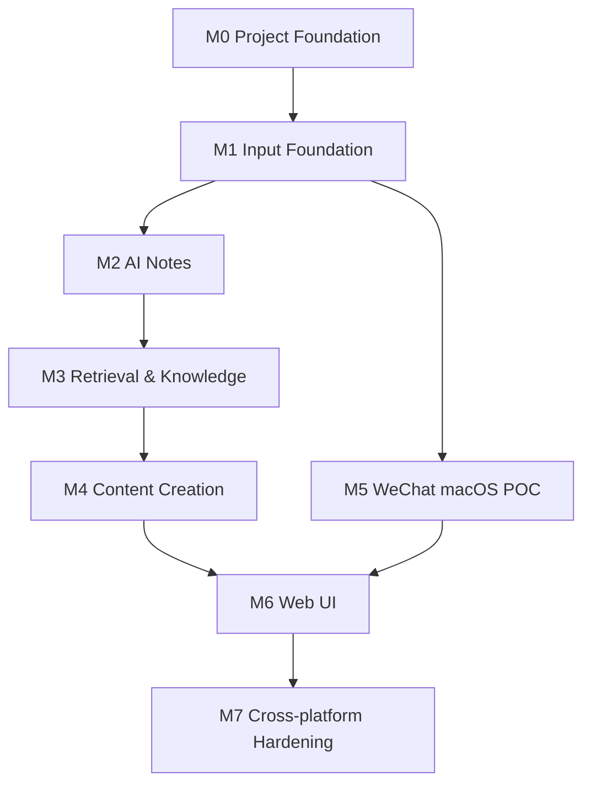
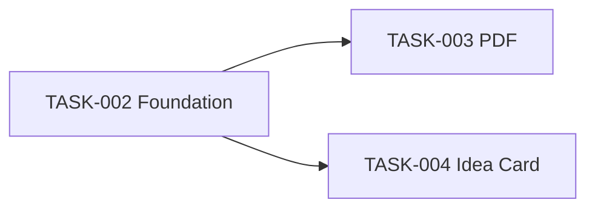

# Personal AI Knowledge Base — ROADMAP.md

> Version: v0.1  
> Owner: MAIN Coordinator only  
> Rule: Worker Agents may read this file but must not edit task status, dependencies, ownership or milestones.

## 1. 目标

把 PRODUCT.md、ARCHITECTURE.md、TECH_STACK.md 转为可执行任务。

原则：

- 小步开发
- 明确依赖
- 能并行的任务由不同 Worker 并行
- 同一 Codex Project 下开独立 Task thread
- 并行改代码时使用独立 branch + worktree
- Worker 完成后回报 MAIN
- MAIN 验收通过后才进入合并 / 下一任务
- 不通过则返回原 Worker 修复
- `main` 保持稳定

---

## 2. 状态定义

- `BLOCKED`：依赖未满足
- `READY`：可以分配
- `IN_PROGRESS`：Worker 正在执行
- `REVIEW`：等待 MAIN 验收
- `DONE`：验收通过并完成合并
- `POC_REQUIRED`：依赖满足后可作为独立可行性任务派发；只能验证，不能假定方案已成立

---

## 3. Milestone 总览



---

# M0 — Project Foundation

## TASK-000 — Read Design Docs and Restate

Status: DONE
Dependencies: none  
Owner: MAIN

Acceptance record: 2026-09-06 用户确认项目理解并授权开始执行；此任务仅阅读复述，无实现代码需要合并。

Codex must first read:

- PRODUCT.md
- ARCHITECTURE.md
- TECH_STACK.md
- ROADMAP.md
- CODEX_HANDOFF.md

Output:

- 用自己的话复述产品目标
- V1 输入 / 输出
- V1 不做什么
- Raw / Notes / Knowledge / Index 区别
- macOS / Windows 边界
- 当前最大风险
- 不写代码

Acceptance:

- 用户确认 Codex 理解正确

---

## TASK-001 — Git + Repository Foundation

Status: DONE  
Dependencies: TASK-000

Owner: MAIN（Git / GitHub / 验收）+ TASK-001 Worker（README / 忽略规则 / 无密钥模板）

Progress: 2026-09-07 本地 main 已初始化，基础文件子范围经 MAIN 复核 PASS；首次提交 27fd0b1 已推送至已核验的 GitHub Private Repository，远端 main 与本地一致。TASK-001 完整验收通过。

Scope:

- 初始化本地 Git repo（如果尚未初始化）
- 准备 `.gitignore`
- 准备 `.env.example`
- 准备基础 README
- 如果 GitHub 私有仓库尚不存在，协助用户创建 `Private Repository`
- 绑定 remote
- 首次 push 前确保私人数据未进入 Git

Acceptance:

- `git status` 清晰
- GitHub repo 为 Private
- 设计文档与基础工程文件可在 GitHub 看到
- `.env` / 私人知识数据没有上传
- 用户理解 `status / diff / commit / push` 的基本作用

---

## TASK-002 — Python Project Skeleton

Status: DONE
Dependencies: TASK-001

Branch:

`feat/project-foundation`

Acceptance record: 2026-09-07 MAIN verified the allowed diff, `uv sync`, sdist/wheel build, `pytest` (7 passed), `pkb health`, `pkb hello`, warning-free CLI execution, cross-platform `pathlib` use, and absence of macOS-only APIs, OCR, vector databases, credentials, and `/Users` hardcodes. Integrated to local `main` as `0d4e040`.

Scope:

- `pyproject.toml`
- uv environment
- `src/pkb/`
- `tests/`
- `data/` 空目录约定
- 基础 config
- 基础 logging
- CLI hello / health check

Acceptance:

- macOS 可安装依赖
- `pytest` 可运行
- CLI health command 可运行
- Core 不依赖 macOS 专属 API
- Windows 路径处理使用跨平台方式（如 pathlib）

---

# M1 — Input Foundation

TASK-003 与 TASK-004 在 TASK-002 后可并行。



## TASK-003 — PDF Import

Status: DONE
Dependencies: TASK-002  
Suggested branch: `feat/pdf-ingest`

Acceptance record: 2026-09-07 MAIN verified allowed scope, immutable Raw storage, deduplication, text-PDF import, scan rejection without OCR, `uv lock --check`, sdist/wheel build, `pytest` (11 passed), and CLI health/hello. PyMuPDF emits five upstream SWIG deprecation warnings under pytest; ordinary V1 test execution passes, while warnings-as-errors is not currently supported by that dependency.

Scope:

- 文本 PDF 导入
- PyMuPDF 文本提取
- UnifiedDocument
- Raw 保存
- metadata
- 去重基础

Not in scope:

- OCR
- 扫描 PDF

Acceptance:

- 文本 PDF 可导入
- 原 PDF 保留
- 提取文本可读
- 重复导入不会产生重复记录
- 扫描 PDF 给出明确“不支持”提示而不是 OCR

---

## TASK-004 — Idea / Quote Card

Status: DONE
Dependencies: TASK-002, TASK-003（UnifiedDocument / Raw interface）
Suggested branch: `feat/idea-card`

Acceptance record: 2026-09-07 MAIN verified immutable UTF-8 idea-card Raw records, optional source/tags/note, duplicate idempotence, PDF Raw regression, CLI add-idea execution, and full `pytest` (17 passed). The existing upstream PyMuPDF/SWIG warning remains tracked under TASK-003.

Scope:

- 手动观点
- 好句
- 灵感
- 用户判断

Acceptance:

- 可创建卡片
- 可保存 optional source / tags / note
- 进入统一 Document / Raw 结构
- 可被后续 Retrieval 使用

---

# M2 — AI Notes

## TASK-005 — AI Provider Interface

Status: DONE
Dependencies: TASK-002  
Suggested branch: `feat/ai-provider`

Acceptance record: 2026-09-07 MAIN verified vendor-neutral interface, network-free mock provider, environment-loaded and masked secret configuration, `pytest` (9 passed), and CLI health/hello. Integrated to local main in `fbdd403`.

Scope:

定义可插拔 Provider interface。

不把模型名 / API Key 写死。

Acceptance:

- mock provider 可用于测试
- provider config 可从环境读取
- Core 不依赖特定厂商 SDK

---

## TASK-006 — Single-document AI Notes

Status: DONE
Dependencies: TASK-003, TASK-004, TASK-005  
Suggested branch: `feat/ai-notes`

Acceptance record: 2026-09-07 MAIN verified five synthetic document Notes, PDF and idea rendering, YAML frontmatter, Raw non-overwrite, Note duplicate idempotence, MockAIProvider-only processing, CLI generation, `uv sync`, and `pytest` (22 passed). The existing upstream PyMuPDF/SWIG warning remains tracked under TASK-003.

Scope:

- summary
- key points
- quotes
- tags
- source references
- Markdown + frontmatter

Acceptance:

- 5 篇测试资料均可产生合法 Note
- Note 不覆盖 Raw
- Note 可以定位回 source
- 观点卡片不被强制套用不合理的长文摘要模板

---

# M3 — Retrieval & Knowledge

TASK-007 与 TASK-008 部分可在共同基础完成后拆 Worker，但 MAIN 应控制文件边界。

## TASK-007 — Index + Related

Status: DONE
Dependencies: TASK-006  
Suggested branch: `feat/index-related`

Acceptance record: 2026-09-07 MAIN verified local JSON rebuild/read, explainable symmetric Related links, no false relation for unrelated Notes, non-mutating Note rebuilds, corrupt-input errors, `uv sync`, `pytest` (27 passed), and CLI index rebuild/status. The existing upstream PyMuPDF/SWIG warning remains tracked under TASK-003.

Scope:

- JSON index
- title / tags / keywords / topic
- related rule scoring
- 双向 related
- 可解释日志

Acceptance:

- 新 Note 可进入 Index
- 相关文档能建立关联
- 关联理由可解释
- Index 可重建
- 不依赖向量库

---

## TASK-008 — Retrieval Service

Status: DONE
Dependencies: TASK-007  
Suggested branch: `feat/retrieval`

Acceptance record: 2026-09-07 MAIN verified the allowed scope, read-only local Index retrieval, deterministic and explainable title/tag/keyword/topic/Related ranking, source paths, clear no-match results, CLI search, no vector database or network use, branch-level tests (5 passed), and merged-main regression (38 passed). The existing upstream PyMuPDF/SWIG warning remains tracked under TASK-003.

Scope:

- title
- tags
- keywords
- topic
- related
- candidate ranking
- AI candidate judgment interface

Acceptance:

- 对测试问题可以找到合理候选
- 返回来源路径
- 没命中时明确告诉调用方
- 不静默调用向量数据库

---

## TASK-009 — Knowledge Compiler

Status: DONE
Dependencies: TASK-006, TASK-007  
Suggested branch: `feat/knowledge-compiler`

Acceptance record: 2026-09-07 MAIN verified the allowed scope, traceable Topic Knowledge compilation from Notes, source links back through Notes to Raw, safe replacement when a topic gains material, Raw/Notes/Index read-only behavior, Mock provider use, branch-level tests (6 passed), and merged-main regression (38 passed). The existing upstream PyMuPDF/SWIG warning remains tracked under TASK-003.

Scope:

- 多 Note → Topic Knowledge
- source trace
- 更新已有 Topic
- 不修改 Raw

Acceptance:

- 5 篇相关资料可编译成一个主题页
- Knowledge 能追踪到 Notes
- Notes 能追踪到 Raw
- 新资料加入后可更新主题页

---

# M4 — Content Creation

## TASK-010 — Q&A / Topic Synthesis

Status: DONE
Dependencies: TASK-008, TASK-009  
Suggested branch: `feat/qa`

Acceptance record: 2026-09-08 MAIN discovered unreported worker changes through the Active Task worktree scan, then verified allowed scope, local-only Knowledge/Notes/Raw evidence chains, structured no-hit and insufficient-evidence states, deterministic Mock-provider test coverage, CLI output, no vector database or network use, branch-level tests (45 passed), and merged-main regression (49 passed). The existing upstream PyMuPDF/SWIG warning remains tracked under TASK-003.

Acceptance:

- “AI 视频有哪些思路？”类问题可基于库内知识回答
- 结果能给出对应来源
- Knowledge 不足时可沿 Notes / Raw 补充

---

## TASK-011 — Topic Generator

Status: DONE
Dependencies: TASK-008, TASK-009  
Suggested branch: `feat/topic-generator`

Acceptance record: 2026-09-08 MAIN discovered unreported worker changes through the Active Task worktree scan, then verified allowed scope, 3–5 explainable local candidates, explicit moderate recency rule, idea-card evidence, source traceability, insufficient-data results without invented candidates, CLI output, no vector database or network use, branch-level tests (42 passed), and merged-main regression (49 passed). The existing upstream PyMuPDF/SWIG warning remains tracked under TASK-003. The concurrent CLI conflict was resolved by MAIN by retaining both independent commands, then tested on merged main.

Scope:

- 全库候选
- 近期资料适当加权
- 观点卡片参与
- 输出 3～5 个候选

Acceptance:

- 不只是重写最近标题
- 每个选题说明为什么值得做
- 每个选题可回溯到支持它的知识 / Notes

---

## TASK-012 — Script Writer

Status: DONE
Dependencies: TASK-011, TASK-008  
Suggested branch: `feat/script-writer`

Acceptance record: 2026-09-08 MAIN discovered unreported worker changes through the Active Task worktree scan, then verified explicit human-confirmation gating, fresh Retrieval on every confirmed request, 2–3 minute bounded Chinese script output, traceable Knowledge/Notes/Raw evidence, no-evidence results without fabrication, deterministic Mock-provider coverage, CLI output, no vector database or network use, branch-level tests (53 passed), and merged-main regression (53 passed). The existing upstream PyMuPDF/SWIG warning remains tracked under TASK-003.

Flow:

选题  
→ 用户选择  
→ Retrieval  
→ 证据上下文  
→ 2～3 分钟口播

Acceptance:

- 未经“用户选题”不自动继续
- 生成前重新检索证据
- 口播可追溯到使用的知识来源
- 内容自然、具体、避免纯鸡汤

---

# M5 — WeChat macOS POC

## TASK-013 — macOS WeChat Favorites Feasibility POC

Status: POC_REQUIRED
Dependencies: TASK-002  
Suggested branch: `poc/wechat-macos`

Progress: synthetic metadata classification and filtering tests pass (6 passed), including video, video-account and ordinary-URL rejection. The actual POC acceptance remains unverified: no official export/sync capability evidence and no safe real-client observation has established incremental discovery, account classification, metadata/content availability, duplicate behavior, or restart behavior. Do not merge this partial branch as a completed POC.

Important:

这是 POC，不得一开始假定技术路线稳定。

Scope:

- macOS 微信收藏本地数据可行性
- 新增项识别
- 微信公众号文章白名单
- 文章 metadata / 正文
- 去重
- 视频 / 普通 URL 过滤

Acceptance:

1. 收藏一篇公众号文章后可检测
2. 可确认属于公众号文章
3. 可得到足够的标题 / 正文 / 来源
4. 第二次同步不重复
5. 收藏视频不会进入
6. 普通 URL 不会进入
7. 微信重启后仍可再次执行
8. 把版本 / 加密 / 数据路径等不确定性记录下来

Failure rule:

若 POC 不稳定：

- 不阻塞 PDF / Idea / Notes / Retrieval / Topics / Script
- 保留手动公众号导入兜底
- MAIN 决定是否延期、换实现或降级

---

## TASK-014 — WeChat Adapter Productionization

Status: BLOCKED  
Dependencies: TASK-013 PASS, TASK-003/004 input foundation stable  
Suggested branch: `feat/wechat-macos`

Acceptance:

- 接入 UnifiedDocument
- 自动去重
- 白名单稳定
- 可由 CLI 调用
- 失败有日志
- 不影响 Core

---

## TASK-015 — macOS Scheduler

Status: BLOCKED  
Dependencies: TASK-014  
Suggested branch: `feat/macos-scheduler`

Scope:

- launchd
- 每日运行 sync command
- 日志
- 手动触发

Acceptance:

- 可重复执行
- 机器重启后配置仍有效
- 失败不会破坏已有知识

---

# M6 — Web UI

## TASK-016 — Streamlit MVP

Status: DONE
Dependencies: TASK-010, TASK-011, TASK-012  
Suggested branch: `feat/web-ui`

Acceptance record: 2026-09-08 MAIN discovered unreported worker changes through the Active Task worktree scan, then verified that the single-page UI delegates to existing Core Services, preserves explicit topic confirmation before Script Writer, supports the V1 daily flow, includes the required project-local Streamlit dependency and lock update, performs PDF/idea minimum vertical slices, and contains UI tests. The system did not provide `uv`; MAIN bootstrapped it only in the Task worktree's local `.venv`, ran `uv sync --locked`, verified Streamlit 1.63.0 import, then ran merged-main regression (60 passed). The existing upstream PyMuPDF/SWIG warning remains tracked under TASK-003.

UI 最少包含：

- PDF import
- Idea card
- Search / Q&A
- Topic synthesis
- Generate topics
- Select topic
- Generate script

Acceptance:

- 主要日常流程不需要 CLI
- UI 只调用 Core，不复制业务逻辑

---

## TASK-020 — UI Visual Redesign

Status: DONE
Dependencies: TASK-016
Suggested branch: `feat/ui-visual-redesign`

Acceptance record: 2026-09-08 MAIN verified the allowed UI-only scope, no new dependencies or external assets, retained Core-service delegation and explicit script-confirmation gate, narrow-screen and desktop rendering against the user-provided visual reference, and full merged-main regression (61 passed). The visual system uses original CSS gradients and shapes rather than reference-image content. The existing upstream PyMuPDF/SWIG warning remains tracked under TASK-003.

Scope:

- 以用户提供的移动端卡片参考图为视觉参考，重做 Streamlit MVP 的布局、色彩、信息层级与响应式体验
- 保留现有导入、检索、知识综合、选题确认与口播业务流程
- 使用代码生成的颜色、渐变与装饰，不引入参考图的人物、品牌或素材

Acceptance:

- 页面具有一致的圆角卡片、浅色背景、彩色重点区与清晰行动入口
- 桌面与窄屏均可使用
- 用户仍可完成完整 V1 日常操作流程
- UI 不复制 Core 业务逻辑
- 现有 UI 与全量回归测试通过

---

## TASK-021 — Usable AI Answering and Topic Resilience

Status: DONE
Dependencies: TASK-005, TASK-009, TASK-010, TASK-016
Owner: MAIN（跨服务 Provider 接入与验收）

Acceptance record: 2026-09-09 MAIN reproduced the user's two-PDF failure locally. Semantic duplicate Topic Knowledge pages (`ai视频` / `ai 视频`) now resolve deterministically to the most recently updated derived page without changing local data. The UI no longer presents test-only Mock output as a real answer. It selects a configured DeepSeek/OpenAI-compatible chat-completions provider, otherwise returns a structured `provider_not_configured` result with the local evidence chain intact. The adapter uses no vendor SDK, sends only the retrieved local context, and has contract tests for endpoint, headers and request body. MAIN verified the user's local data produces five topic candidates and a non-fabricated answer state; full regression: 65 passed. The existing upstream PyMuPDF/SWIG warning remains tracked under TASK-003.

Scope:

- 处理历史 Knowledge 派生页的语义重复，不能删除或迁移用户本地资料
- 为 UI 配置真实的 OpenAI-compatible Provider，优先支持 DeepSeek
- 未配置密钥时禁止将 Mock 文本伪装为用户可用回答
- 保留 Q&A 的 Knowledge / Notes / Raw 证据链

Acceptance:

- 同主题的空格差异不会阻塞选题生成，且稳定选用最新 Knowledge
- 当前本地两篇 PDF 能生成可解释的选题候选
- 无 Provider 配置时 Q&A 返回证据与明确状态，不产生 Mock answer
- 配置 Provider 后通过 `chat/completions` 生成仅基于本地证据的回答
- 全量测试通过，`.env` 与 `data/` 不纳入 Git

---

## TASK-022 — Session-only AI Provider Configuration UI

Status: DONE
Dependencies: TASK-016, TASK-021
Owner: MAIN（密钥边界与验收）

Acceptance record: 2026-09-10 MAIN added a sidebar configuration form for DeepSeek and OpenAI-compatible endpoints. Provider, model, endpoint and API Key can be applied directly from the UI; the API Key uses a password field and is retained only in the current Streamlit browser session. It is not written to `.env`, logs, data files or Git. MAIN verified the rendered controls on the local Streamlit page and full regression: 67 passed. No live API credential or external request was used during verification.

Scope:

- 在 UI 中填写 Provider、模型、API endpoint 与 API Key
- 将配置仅用于当前浏览器会话的 Semantic Actions
- 提供清除当前会话配置的入口

Acceptance:

- 用户无需编辑 `.env` 即可在 UI 中应用 API 配置
- API Key 使用 password 输入框，且不出现在页面状态、日志、数据或 Git
- 刷新或关闭会话后 Key 自动失效
- 支持 DeepSeek 与 OpenAI-compatible chat-completions endpoint
- 全量测试通过

---

## TASK-023 — UI Contrast and Sidebar Brand Legibility

Status: DONE
Dependencies: TASK-020, TASK-022
Owner: MAIN（小范围 UI 修复与验收）

Acceptance record: 2026-09-10 MAIN raised the contrast of muted page text and sidebar labels, strengthened the sidebar status card, input and button states, and replaced the ambiguous sidebar star with a high-contrast PKB brand mark. A follow-up screenshot exposed that Streamlit's global light form card was still overriding the Provider section while its labels remained light. MAIN added sidebar-specific form, label, submit-button, and expander selectors, then translated the Provider settings labels and validation text to Chinese. A later inspection found the preview server was running an old worktree, so MAIN restarted it from current main. The collapsed-sidebar control is now styled through the live Streamlit header as a deep-purple button with a white icon and outline. MAIN then verified the actual retrieval result expanders: titles, arrows, scores, captions and other muted text now use explicit dark contrast on light cards. MAIN reloaded the local desktop page and ran the full regression suite (67 passed). Main-flow behavior is unchanged; no data, provider settings or credentials were changed.

Scope:

- 修复文字、侧栏控制项与品牌标识的可读性
- 保持现有布局、功能与 session-only API Key 边界

Acceptance:

- 常规文字与辅助文字在浅色页面上清晰可读
- 侧栏输入框、按钮、展开配置区和流程项有明确前景/背景对比
- 品牌标识可辨认，且不引入外部图片资源
- UI 与全量回归测试通过

---

## TASK-024 — Standalone Roadmap Dashboard

Status: DONE
Dependencies: TASK-016
Owner: MAIN

Acceptance record: 2026-09-11 MAIN added an independent local Streamlit dashboard that parses the canonical ROADMAP.md at render time. It shows completion progress, status filters, dependencies, owners and the existing acceptance/progress record for every task. The dashboard does not poll; it reflects a task only after MAIN has accepted it and updated ROADMAP.md, then the page is reloaded. The original knowledge-base page remains unchanged. MAIN verified the standalone light, high-contrast page at 127.0.0.1:8502 and ran the full regression suite (69 passed).

Scope:

- 独立显示 ROADMAP.md 的任务状态和说明
- 不维护第二份任务状态
- 不改动原知识库页面

Acceptance:

- 页面展示总任务、完成进度、可推进和受阻任务
- 每项任务可查看依赖、负责人和最近记录
- 仅在 ROADMAP.md 被 MAIN 更新后、页面重载时同步
- 全量回归测试通过

---

# M7 — Cross-platform Hardening

## TASK-017 — Windows Core Smoke Test

Status: BLOCKED  
Dependencies: M4 core loop stable  
Suggested branch: `chore/windows-compat`

Scope:

只验证核心代码：

- install
- PDF
- Idea Card
- Notes
- Index
- Retrieval
- Topics / Script
- paths / encoding

Not required:

- Windows WeChat sync

Acceptance:

- Core 在 Windows 可运行
- 平台差异没有渗进 Core

---

## TASK-018 — Windows Scheduler Adapter

Status: BACKLOG  
Dependencies: TASK-017

使用 Windows Task Scheduler 适配定时任务。

---

## TASK-019 — Windows WeChat Adapter

Status: BACKLOG  
Dependencies: TASK-017

未来独立实现。

不得为它维护一套长期 Windows branch。

---

## TASK-025 — Hybrid Semantic Retrieval

Status: IN_PROGRESS  
Dependencies: TASK-008, TASK-010, TASK-020  
Owner: MAIN + TASK-025 Worker  
Suggested branch: `feat/hybrid-semantic-retrieval`

Trigger: 2026-09-12 用户真实检索样本显示，仅关键词和 Related 规则无法召回“人物动作更自然”与“运动一致性 / 镜头连续性”等不同措辞的内容。

Scope:

- 在现有本地 JSON Index 上增加可替换的本地语义相似度层
- 保留标题、标签、关键词、Topic 的可解释直接匹配
- 定义各信号权重；Related 总贡献不得超过 0.10
- 输出每个候选的语义分数与来源证据
- 支持离线最小样本与真实 UI 检索验收

Not in scope:

- 云端向量数据库
- 把 Raw / Notes / Knowledge 改造成 Chunk 主架构
- 修改真实 API Key 或迁移已有用户数据

Acceptance:

- `AI视频` 仍优先召回视频文章
- 同义但不同措辞的 AI 视频问题可命中语义相关文章
- Related 链接数量不能主导排名
- 结果仍可追溯到 Index / Note / Raw 来源
- 自动测试、真实 UI 样本、git diff 均由 MAIN 验收

---

# 4. 推荐首轮并行策略

TASK-002 完成后：

可以并行：

- Worker A → TASK-003 PDF
- Worker B → TASK-004 Idea Card
- Worker C → TASK-005 AI Provider
- Worker D → TASK-013 WeChat macOS POC（独立风险探索）

主链不要等待 WeChat POC 才继续。

---

# 5. Worker Completion Contract

每个 Worker 完成时必须回报：

```text
TASK:
STATUS: PASS / BLOCKED

完成：
- ...

修改文件：
- ...

测试：
- ...
- X passed / X failed

未解决：
- ...

Branch:
Worktree:

Commit:
（如尚未获准 commit，写 NOT COMMITTED）

验收步骤：
1.
2.
3.

风险 / 说明：
- ...
```

MAIN 不接受“已完成”作为唯一验收证据。

---

# 6. MAIN 验收规则

MAIN 需要检查：

- Task 是否只做约定 scope
- Diff 是否合理
- Tests 是否通过
- Acceptance 是否全部满足
- 是否引入无关重构
- 是否破坏跨平台要求
- 是否碰了 Raw immutable 原则

PASS：

- 才允许进入 merge / DONE
- 更新 ROADMAP
- 解锁下一依赖任务

FAIL：

- 返回原 Worker
- 保持原 worktree
- 只修失败项
- 增加对应 regression test
- 再次提交 REVIEW
